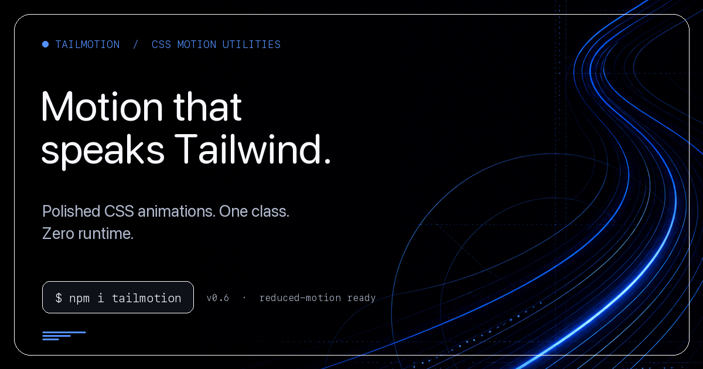

<p align="center">
  <a href="https://tailmotion.moumen.dev/">
    <picture>
      <source media="(prefers-color-scheme: dark)" srcset="./docs/logo/dark.svg">
      <source media="(prefers-color-scheme: light)" srcset="./docs/logo/light.svg">
      
    </picture>
  </a>
</p>

<h1 align="center">TailMotion</h1>

<p align="center">
  <strong>Purposeful CSS motion that speaks Tailwind.</strong>
  <br>
  Add tuned keyframes and interruptible transitions with composable classes and no runtime in the core stylesheet.
</p>

<p align="center">
  <a href="#quickstart">Quickstart</a> ·
  <a href="#motion-reference">Motion reference</a> ·
  <a href="https://tailmotion.moumen.dev/#explorer">Animation explorer</a> ·
  <a href="https://github.com/moumen-soliman/tailmotion/issues/new">Feedback</a> ·
  <a href="CONTRIBUTING.md">Contributing</a>
</p>

<p align="center">
  <a href="https://www.npmjs.com/package/tailmotion"></a>
  <a href="https://www.npmjs.com/package/tailmotion"></a>
  <a href="LICENSE.md"></a>
</p>

<p align="center">
  <a href="https://tailmotion.moumen.dev/">
    
  </a>
</p>

## Add motion without adding a runtime

```css
@import "tailmotion/css";
```

```html
<button class="tm-press rounded-lg bg-blue-600 px-4 py-2 text-white">
  Save changes
</button>

<div class="tm-slide-block-start tm-duration-300 tm-ease-out">
  Ready.
</div>
```

TailMotion leads with classes, not components. Tailwind owns layout, color,
typography and responsive design; TailMotion owns how an element enters, exits,
responds and repeats.

- **Zero-runtime CSS core** — importing the stylesheet adds no JavaScript.
- **A deliberate motion vocabulary** — entrances, exits, continuous effects,
  interactions and choreography utilities each have one job.
- **Interruptible interactions** — press, hover and toggle utilities use
  transitions, so they reverse smoothly when intent changes.
- **Theme-ready** — core effects inherit `currentColor`; specialized effects
  expose focused `--tm-*` variables and optional color presets.
- **RTL-aware** — logical direction classes mirror in right-to-left contexts.
- **Reduced-motion aware** — the shared base layer covers animations,
  transitions, pseudo-elements and animated children.
- **Framework-agnostic** — use the same classes in React, Vue, Svelte or HTML.
- **Modular when needed** — import the full stylesheet or explicit
  per-animation CSS files.

## Quickstart

### Install

```bash
npm install tailmotion
# or
pnpm add tailmotion
# or
yarn add tailmotion
```

### Import the stylesheet

Import the CSS file in your project:

```css
@import 'tailmotion/css';
```

This path requires no Tailwind setup. It includes every animation plus a curated
set of prebuilt state and responsive variant selectors.

**In JavaScript/TypeScript:**
```js
// React, Next.js, Vue, Svelte, etc.
import 'tailmotion/css';
```

**In standalone HTML:**
```html
<link rel="stylesheet" href="https://cdn.jsdelivr.net/npm/tailmotion@0.6.0/tailmotion.css">
```

Pin the CDN URL to the release you tested. In an application with a bundler,
prefer the CSS or JavaScript import.

### Add the Tailwind plugin (optional)

The stylesheet contains the motion classes. Add the plugin when you also want
configurable timing, easing, repeat, stagger and distance utilities:

**Tailwind CSS v4:**

```css
@import 'tailwindcss';
@plugin 'tailmotion/plugin';
@import 'tailmotion/css';
```

**Tailwind CSS v3:**

```js
// tailwind.config.js (CommonJS)
module.exports = {
  content: ['./src/**/*.{js,jsx,ts,tsx,html}'],
  plugins: [
    require('tailmotion/plugin')
  ]
};

// tailwind.config.ts (ESM)
import type { Config } from 'tailwindcss';
import tailmotion from 'tailmotion/plugin';

export default {
  content: ['./src/**/*.{js,jsx,ts,tsx,html}'],
  plugins: [tailmotion]
} satisfies Config;
```

Then import the CSS after Tailwind:

```css
@tailwind base;
@tailwind components;
@tailwind utilities;
@import 'tailmotion/css';
```

### Import individual motion files

The full `tailmotion/css` entry includes the entire library. For a smaller,
explicit stylesheet, import the shared base and only the motion files you use:

```css
@import 'tailmotion/animations/base.css';
@import 'tailmotion/animations/fade.css';
@import 'tailmotion/animations/interactions.css';
```

Keep `base.css`: it provides shared variables, RTL mirroring and reduced-motion
behavior. Per-animation imports do not automatically include the prebuilt
selectors from `variants.css`.

### Use the classes

```html
<!-- Basic animation -->
<div class="tm-fade-in">Hello</div>

<!-- With hover -->
<button class="hover:tm-bounce">Click me</button>

<!-- With timing -->
<div class="tm-slide-block-start tm-duration-500 tm-delay-200">Delayed</div>

<!-- Responsive -->
<div class="md:tm-pop lg:hover:tm-wiggle">Responsive</div>

<!-- Motion composes with Tailwind; it never competes with it -->
<button class="rounded-lg bg-blue-600 px-4 py-2 text-white tm-press focus-visible:tm-glow">
  Save changes
</button>
```

## Framework examples

### React / Next.js

```jsx
// app/layout.jsx or _app.jsx
import 'tailmotion/css';

export default function Button() {
  return (
    <button className="hover:tm-bounce tm-duration-300">
      Click me
    </button>
  );
}
```

### Vue

```vue
<script setup>
import 'tailmotion/css';
</script>

<template>
  <button class="hover:tm-shake">Click me</button>
</template>
```

### Svelte

```svelte
<script>
  import 'tailmotion/css';
</script>

<button class="hover:tm-wiggle">Click me</button>
```

### Vanilla HTML

```html
<!DOCTYPE html>
<html>
<head>
  <link rel="stylesheet" href="https://cdn.jsdelivr.net/npm/tailmotion@0.6.0/tailmotion.css">
</head>
<body>
  <div class="tm-fade-in">Hello World</div>
</body>
</html>
```

## Motion model

The core model has five categories, each with one job:

| Category | Built from | Repeats | Use for |
|----------|-----------|---------|---------|
| **Entrance** | keyframes | once | An element arriving |
| **Exit** | keyframes | once | An element leaving |
| **Continuous** | keyframes | infinite | Ambient and loading states |
| **Interaction** | transitions | n/a | Hover, press, toggle |
| **Choreography** | variables | n/a | Timing, easing, stagger, distance |

Only continuous animations default to `infinite`. Only interaction utilities are
built from transitions, because only they need to survive a change of mind
mid-flight.

### Entrance
| Class | Description |
|-------|-------------|
| `tm-fade-in` | Fade in. Opacity only |
| `tm-scale-in` | Scale up from `--tm-scale-from` with a fade |
| `tm-pop` | Scale up with overshoot |
| `tm-blur-in` | Blur to focus |
| `tm-slide-block-start` | Travel toward the block-start edge (enter from below) |
| `tm-slide-block-end` | Travel toward the block-end edge (enter from above) |
| `tm-slide-inline-start` | Travel toward the inline-start edge, mirrored in RTL |
| `tm-slide-inline-end` | Travel toward the inline-end edge, mirrored in RTL |

Entrances are short by default (220-280ms, ease-out) and travel `--tm-distance`
(12px). Retune both with `tm-duration-*` and `tm-distance-*`.

The physical names `tm-slide-up`, `tm-slide-down`, `tm-slide-left` and
`tm-slide-right` are kept as aliases of the logical classes, in that order.
Prefer the logical names: they mirror themselves in right-to-left contexts,
where the physical names would send an element the wrong way.

### Exit
| Class | Description |
|-------|-------------|
| `tm-fade-out` | Fade out. Opacity only |
| `tm-scale-out` | Shrink to `--tm-exit-scale` with a fade |
| `tm-blur-out` | Focus to blur |
| `tm-slide-block-out` | Leave toward the block-start edge |
| `tm-slide-inline-out` | Leave toward the inline-end edge, mirrored in RTL |

Exits are about 20% faster than the entrance they mirror and travel
`--tm-exit-distance`, 70% of an entrance: the user's attention is already moving
on, so an exit should not compete for it. Each exit holds its final frame, so
the element stays hidden but still occupies layout - remove the node once the
animation ends.

`tm-zoom-out` predates this vocabulary and is an *entrance* despite its name.
For a real exit use `tm-scale-out`.

### Interaction
Transitions, not keyframes: release a press halfway through and it reverses
smoothly instead of restarting.

| Class | Description |
|-------|-------------|
| `tm-press` | Scale to `0.96` while pressed, 150ms. Skips `:disabled` and `[aria-disabled]` |
| `tm-hover-lift` | Rise `--tm-lift-distance` with a shadow on hover or keyboard focus |
| `tm-hover-scale` | Grow to `--tm-hover-scale` on hover or keyboard focus |
| `tm-icon-swap` | Cross-fade two glyphs, driven by real component state |
| `tm-rotate-hover` | Rotate `--tm-rotate` on hover or keyboard focus |
| `tm-rotate-press` | Scale and rotate while pressed |
| `tm-lift-hover` | Alias of `tm-hover-lift` |

```html
<button class="tm-press">Save</button>

<button class="tm-icon-swap" aria-pressed="false">
  <svg><!-- shown while aria-pressed is false --></svg>
  <svg><!-- shown while aria-pressed is true --></svg>
</button>
```

`tm-icon-swap` reads its state from `.tm-swapped`, `[data-tm-swap="on"]`,
`aria-pressed`, `aria-expanded` or `aria-checked`, so the motion follows the
state your component already exposes instead of a parallel flag. Both children
stay in the DOM, so the outgoing glyph animates out as cleanly as the incoming
one animates in.

## Motion reference

### Loop animations
| Class | Description |
|-------|-------------|
| `tm-bounce` | Bouncing animation |
| `tm-pulse` | Breathing scale effect |
| `tm-spin` | 360° rotation |
| `tm-float` | Gentle floating |
| `tm-drift` | Ambient horizontal drift |
| `tm-glow` | Pulsing glow/shadow |
| `tm-morph` | Subtle breathing morph |
| `tm-sway` | Pendulum sway |
| `tm-sparkle` | Twinkling star effect |
| `tm-shimmer` | Continuous sweeping highlight, for skeletons and loading |

### Attention animations
| Class | Description |
|-------|-------------|
| `tm-shake` | Horizontal shake |
| `tm-wiggle` | Quick wiggle |
| `tm-elastic` | Elastic bounce |
| `tm-ripple` | Ripple pulse effect |
| `tm-burst` | Explosion outward |

### Other entrance animations
Beyond the core entrance vocabulary above.

| Class | Description |
|-------|-------------|
| `tm-drop` | Drop in with bounce |
| `tm-zoom-in` | Zoom in with fade and overshoot |
| `tm-zoom-in-slow` | The same, slower |
| `tm-zoom-out` | Settle in from a larger scale (an entrance, despite the name) |
| `tm-rotate-in` | Rotate and scale in |
| `tm-swing-in` | Swing in from the top |
| `tm-swing-in-left` | Swing in from the inline start |
| `tm-swing-in-right` | Swing in from the inline end |

### Professional animations
| Class | Description |
|-------|-------------|
| `tm-reveal` | Clip-path reveal from bottom |
| `tm-unfold` | Elegant unfold from top |
| `tm-glide` | Smooth slide from left |
| `tm-glide-right` | Smooth slide from right |
| `tm-scale-fade` | Subtle scale with fade |
| `tm-rise` | Rise up with slight rotation |
| `tm-fill-up` | Bottom to top fill reveal |
| `tm-stagger` | Auto-stagger children |

### Transform animations
| Class | Description |
|-------|-------------|
| `tm-flip-x` | 3D flip on X axis |
| `tm-flip-y` | 3D flip on Y axis |

### Interactive hover animations
| Class | Description |
|-------|-------------|
| `tm-shimmer-hover` | Sheen sweep on hover |
| `tm-liquid-btn` | Liquid fill button |
| `tm-liquid-btn-top` | Liquid fill from top |
| `tm-liquid-btn-left` | Liquid fill from left |
| `tm-liquid-btn-right` | Liquid fill from right |
| `tm-liquid-btn-center` | Liquid fill from center |
| `tm-liquid-wave` | Wave fill effect |
| `tm-liquid-underline` | Underline fill effect |
| `tm-flip-hover` | 3D flip on hover |
| `tm-hold-delete` | Press-and-hold confirmation |

See **Interaction** above for `tm-press`, `tm-hover-lift`, `tm-hover-scale`,
`tm-icon-swap`, `tm-rotate-hover` and `tm-rotate-press`.

### Number and count animations
| Class | Description |
|-------|-------------|
| `tm-count-reveal` | Slot-machine style digits (wrap in spans) |
| `tm-slide-digit` | Single digit slide up |
| `tm-confetti` | Falling celebration |

### Text animations
| Class | Description |
|-------|-------------|
| `tm-text-flip` | Container for text flip (requires JS) |
| `tm-text-morph` | Container for text morph (requires JS) |
| `tm-text-rotate` | Container for text rotate |

### Structured recipes
| Class | Description |
|-------|-------------|
| `tm-avatar-group` | Animated avatar stack |
| `tm-avatar` | Individual avatar in group |
| `tm-avatar-ring` | Avatar with ring effect |
| `tm-avatar-tooltip` | Tooltip for avatar |
| `tm-view-morph` | Cross-fade views while the container reshapes |

These classes require the documented child structure. Treat them as optional
recipes: TailMotion provides the movement, while your Tailwind classes should
provide dimensions, colors and typography.

#### View morph

Keep every view mounted, add `data-tm-panel` to each one, and move
`data-tm-active` when your component state changes. Update `--tm-view-width`
and `--tm-view-height` to the active view's dimensions:

```html
<div
  class="tm-view-morph rounded-full bg-black"
  style="--tm-view-width: 100px; --tm-view-height: 28px"
>
  <div data-tm-panel data-tm-active>Idle</div>
  <div data-tm-panel aria-hidden="true">Call</div>
  <div data-tm-panel aria-hidden="true">Timer</div>
</div>
```

The class animates numeric dimensions; your component is responsible for
setting the next values and keeping `data-tm-active` and `aria-hidden` in sync.
This keeps the CSS core runtime-free while allowing React, Vue, Svelte or plain
JavaScript to own state. Tune the outgoing view with `--tm-view-exit-scale`,
`--tm-view-exit-scale-x` and `--tm-view-exit-y`.

## Variants

The bundled stylesheet includes a curated set of prebuilt variants for common
animations. The supported combinations include `hover:`, `focus:`,
`focus-visible:`, `active:`, `focus-within:`, `group-hover:`, `motion-safe:`
and selected responsive combinations. The base `tm-*` class remains available
for every animation.

The set is deliberately finite: importing `tailmotion/css` does not generate
every possible Tailwind variant for every class. Check
[`src/animations/variants.css`](src/animations/variants.css) when a particular
combination matters.

```html
<!-- State variants -->
<div class="hover:tm-bounce">Hover me</div>
<input class="focus-visible:tm-glow" />
<button class="active:tm-shake">Press me</button>

<!-- Group hover -->
<div class="group">
  <div class="group-hover:tm-spin">Icon</div>
</div>

<!-- Responsive -->
<div class="sm:tm-fade-in md:tm-slide-up lg:tm-pop">
  Different animation per breakpoint
</div>

<!-- Combined -->
<div class="md:hover:tm-bounce">
  Hover effect on medium screens+
</div>

<!-- Motion safe -->
<div class="motion-safe:tm-bounce">
  Only animates if user prefers motion
</div>
```

## Timing utilities

### Duration
```html
<div class="tm-bounce tm-duration-300">Fast</div>
<div class="tm-bounce tm-duration-700">Slow</div>
```

Available: `150`, `200`, `300`, `400`, `500`, `700`, `900`, `1000`, `1200`, `1400`, `1600`, `2000`, `3000`

### Delay
```html
<div class="tm-fade-in tm-delay-0">First</div>
<div class="tm-fade-in tm-delay-150">Second</div>
<div class="tm-fade-in tm-delay-300">Third</div>
```

Available: `0`, `75`, `150`, `200`, `300`, `400`, `500`, `700`, `1000`

### Easing
```html
<div class="tm-pop tm-ease-bouncy">Bouncy</div>
<div class="tm-pop tm-ease-snappy">Snappy</div>
```

Available: `linear`, `in`, `out`, `in-out`, `soft`, `snappy`, `bouncy`

### Repeat
```html
<div class="tm-bounce tm-repeat-3">3 times</div>
<div class="tm-bounce tm-repeat-infinite">Forever</div>
```

Available: `1`, `2`, `3`, `infinite`

### Distance
How far a slide entrance travels. Exits derive from it, at 70%.

```html
<div class="tm-slide-block-start tm-distance-4">Barely moves</div>
<div class="tm-slide-block-start tm-distance-30">Pre-0.6 travel</div>
```

Available: `4`, `8`, `12` (default), `20`, `30`

### Stagger step
```html
<ul class="tm-stagger tm-stagger-step-150">...</ul>
```

Available: `50`, `75`, `100` (default), `150`, `200`

### GPU promotion
TailMotion never promotes an element to its own compositing layer permanently.
Add `tm-gpu` only where you have measured first-frame stutter, since every extra
layer costs memory.

```html
<div class="tm-float tm-gpu">Measured, and it needed it</div>
```

## Stagger animation

Children enter in DOM order, `--tm-stagger-step` apart (100ms by default, for up
to 20 children):

```html
<ul class="tm-stagger">
  <li>Item 1</li>  <!-- delay: 0ms -->
  <li>Item 2</li>  <!-- delay: 100ms -->
  <li>Item 3</li>  <!-- delay: 200ms -->
</ul>
```

Tune the step with a utility or a variable:

```html
<ul class="tm-stagger tm-stagger-step-150">...</ul>

<ul class="tm-stagger" style="--tm-stagger-step: 60ms">...</ul>
```

Stagger reads as hierarchy when the groups are semantic - title, then
description, then actions - and as a queue when it is just a list of rows. Reach
for it on a first load or an empty state, not on a hover or a tab switch that
repeats all day.

```html
<div class="tm-stagger">
  <h1>Welcome</h1>
  <p>A description of the page.</p>
  <div><button class="tm-press">Get started</button></div>
</div>
```

## Count reveal

For slot-machine style number reveal:

```html
<div class="tm-count-reveal">
  <span>1</span>
  <span>2</span>
  <span>,</span>
  <span>3</span>
  <span>4</span>
  <span>5</span>
</div>
```

## Text flip (requires JavaScript)

For rotating text with blur effect:

```html
<span id="text-container" class="tm-text-flip"></span>
```

```js
import { initTextFlipElement } from 'tailmotion/utils';

initTextFlipElement(document.getElementById('text-container'), {
  words: ['beautiful', 'amazing', 'powerful'],
  variant: 'flip', // 'flip', 'morph', 'rotate', 'chars'
  interval: 2500
});
```

## Liquid button

Interactive button with liquid fill effect:

```html
<button
  class="tm-liquid-btn px-6 py-3 border rounded-lg text-gray-300 hover:text-black"
  style="--tm-liquid-color: white;"
>
  Hover me
</button>
```

CSS variables:
- `--tm-liquid-color`: Fill color (default: currentColor)
- `--tm-liquid-bg`: Background color (default: transparent)
- `--tm-liquid-duration`: Animation duration (default: varies by variant)
- `--tm-liquid-line-height`: Line height for underline variant (default: 2px)

## Custom timing

Use CSS variables for custom values:

```html
<div class="tm-bounce" style="--tm-duration: 1800ms; --tm-delay: 120ms;">
  Custom timing
</div>
```

With the optional plugin, use arbitrary token values. Tailwind's arbitrary
property syntax also works directly:

```html
<div class="tm-pulse tm-duration-[1350ms]">Custom duration</div>
<div class="tm-slide-block-start [--tm-delay:420ms]">Custom delay</div>
```

## Colors and theming

General effects derive their color from the element's own `currentColor`, so
they match whatever Tailwind already put on the element:

```html
<!-- The glow is purple because the text is purple -->
<button class="text-purple-600 focus-visible:tm-glow">Save</button>
```

Override any of them with an exact value - alpha included, and it is preserved:

| Variable | Used by | Default |
|----------|---------|---------|
| `--tm-color` | The root every other colour derives from | `currentColor` |
| `--tm-shadow-color` | `tm-hover-lift`, avatar tooltip shadow | 25% of `--tm-color` |
| `--tm-glow-color` | `tm-glow` | 45% of `--tm-color` |
| `--tm-outline-color` | `tm-ripple`, `tm-avatar-ring` | 40% of `--tm-color` |
| `--tm-shimmer-color` | `tm-shimmer`, `tm-shimmer-hover` | `--tm-color` |
| `--tm-shimmer-opacity` | Shimmer highlight strength | `0.35` |

```css
:root {
  --tm-glow-color: rgb(59 130 246 / 0.55);
  --tm-shadow-color: oklch(0.2 0.02 260 / 0.35);
}
```

Derived colours use `color-mix(in oklab, ...)`, with a plain `--tm-color`
fallback where `color-mix()` is unavailable. Gradient effects interpolate
`in oklab` where supported, falling back to sRGB otherwise.

Specialized effects such as liquid fills, wavy backgrounds and hold-to-delete
expose their own variables. They also retain optional named color presets for
convenience and backwards compatibility; using a preset is opt-in.

Color, contrast, theming and component appearance remain your responsibility.
Never let a TailMotion effect be the only signal of a state: pair it with a
label, icon or focus ring, and verify any supplied color on its actual light
and dark backgrounds.

## Right-to-left

Logical classes read `--tm-inline-flip`, which TailMotion sets to `-1` under
`[dir="rtl"]`, so inline-axis motion mirrors itself with no extra markup:

```html
<div dir="rtl">
  <!-- travels toward the inline start, which here is the right edge -->
  <div class="tm-slide-inline-start">مرحبا</div>
</div>
```

The physical aliases (`tm-slide-left`, `tm-slide-right`) mirror too, since they
point at the same keyframes - which is exactly why their names are misleading in
an RTL context and the logical ones are worth preferring.

## Reduced motion

Under `prefers-reduced-motion: reduce`, every TailMotion animation and
transition collapses to 1ms rather than being removed. The state a class
communicates still lands; it simply lands instantly. Pseudo-elements and the
unclassed children of `tm-stagger`, `tm-count-reveal` and `tm-icon-swap` are
covered too.

Use `motion-safe:` for motion that carries no information at all:

```html
<div class="motion-safe:tm-float">Purely decorative</div>
```

## Optional JavaScript utilities

The CSS core has no JavaScript runtime. A separate utilities entry is available
when an application needs dynamic number interpolation, text rotation or class
helpers:

```js
import {
  animateValue,
  createTextRotator,
  formatNumber,
  createCountSpans,
  replayAnimation,
  cssVars,
  staggerStyle,
  tm
} from 'tailmotion/utils';

// Animate a count
animateValue({
  from: 0,
  to: 1000,
  duration: 2000,
  onUpdate: (value) => {
    element.textContent = formatNumber(value);
  }
});

// Create span data for count reveal (React/Vue friendly)
const spans = createCountSpans('12,345');
// Returns: [{ char: '1', style: { '--tm-stagger': 0 }, delay: 0 }, ...]

// Replay an animation
replayAnimation(element, 'tm-bounce');

// Generate CSS variables
const style = cssVars({ duration: '500ms', delay: '100ms' });
// Returns: { '--tm-duration': '500ms', '--tm-delay': '100ms' }

// Build animation class
const className = tm('bounce', { duration: 500, delay: 200 });
// Returns: 'tm-bounce tm-duration-500 tm-delay-200'
```

## Tailwind plugin configuration

Extend or customize tokens via the plugin:

```js
// tailwind.config.js
module.exports = {
  plugins: [
    require('tailmotion/plugin')({
      durations: {
        750: '750ms',
        1500: '1500ms'
      },
      easing: {
        springy: 'cubic-bezier(0.22, 1, 0.36, 1)'
      },
      delays: {
        600: '600ms'
      },
      stagger: {
        120: '120ms'
      },
      distance: {
        16: '16px'
      }
    })
  ]
};
```

Or via theme:

```js
// tailwind.config.js
module.exports = {
  theme: {
    extend: {
      tailmotion: {
        durations: { 750: '750ms' },
        easing: { springy: 'cubic-bezier(0.22, 1, 0.36, 1)' }
      }
    }
  },
  plugins: [require('tailmotion/plugin')]
};
```

## Browser support

Works in all modern browsers that support CSS animations, custom properties and
cascade layers. Two newer features degrade rather than break: `color-mix()` falls
back to a flat `--tm-color`, and `in oklab` gradient interpolation falls back to
sRGB.

## Migrating to 0.6

0.6 turns the class list into a deliberate vocabulary. Nothing was removed, but
some defaults changed.

**Timing tokens now behave as documented.** `--tm-duration`, `--tm-delay`,
`--tm-easing` and `--tm-iteration-count` no longer carry root values. Previously
the root value shadowed every per-class default, so every animation ran at 400ms
and every loop animation ran exactly once - `tm-spin`, `tm-pulse` and
`tm-glow` included. Each class now uses its own tuned timing, and loop
animations loop. `tm-duration-*`, `tm-delay-*`, `tm-ease-*` and `tm-repeat-*`
override them exactly as before.

**Entrances are shorter and travel less.** Slides run 260ms over 12px, where
they were 400ms over 30px. Restore the old feel with
`tm-distance-30 tm-duration-500`, or globally:

```css
:root { --tm-distance: 30px; }
```

**`tm-fade-in` is opacity only.** It no longer lifts 10px. For fade plus lift,
use `tm-slide-block-start`.

**`tm-blur-in` is shorter and no longer scales.** 280ms, opacity and blur only.

**Hover and press utilities are transitions.** `tm-lift-hover`,
`tm-rotate-hover` and `tm-rotate-press` no longer replay a keyframe, so
releasing early reverses smoothly. `tm-lift-hover` also stopped forcing
`display: inline-flex` on the element; add `inline-flex` yourself if you were
relying on it.

**Effects no longer carry colors.** The blue in `tm-glow`, the indigo in
`tm-ripple`, the white in `tm-shimmer-hover`, the black-and-white avatar tooltip
and its blue ring are gone; all of them now derive from `currentColor`. See
[Colors and theming](#colors-and-theming) to pin exact values.

**`will-change` is opt-in.** It was removed from every one-shot animation and
from properties that cannot be GPU-composited. Add `tm-gpu` where you have
measured first-frame stutter.

**Stagger steps 100ms, not 80ms.** `staggerStyle()` likewise defaults to 100ms
and now emits `--tm-stagger-index` alongside `--tm-stagger`, so it drives
`tm-stagger` containers as well as `tm-count-reveal`.

**Prefer the logical slide names.** `tm-slide-up`, `tm-slide-down`,
`tm-slide-left` and `tm-slide-right` still work, as aliases of
`tm-slide-block-start`, `tm-slide-block-end`, `tm-slide-inline-start` and
`tm-slide-inline-end`.

## Community

- Read [CONTRIBUTING.md](CONTRIBUTING.md) before opening a substantial change.
- Participation is governed by the
  [TailMotion Code of Conduct](CODE_OF_CONDUCT.md).
- Report bugs and propose features through
  [GitHub Issues](https://github.com/moumen-soliman/tailmotion/issues).

## License

[MIT](LICENSE.md) © [Moumen Soliman](https://github.com/moumen-soliman)
